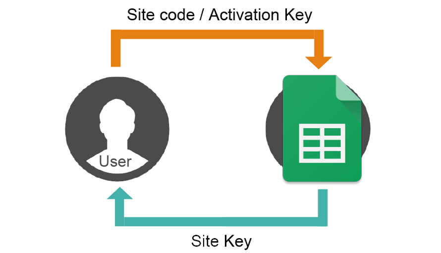

  <h1><b>C-Sharp License Key Console Application (.NET Framework) 🔑</b></h1>
  

## Overview
This is a C# console application built using .NET Framework for generating and validating license keys based on hardware identifiers (HDD and BIOS serial numbers). The application uses MD5 hashing for key generation and integrates with Google Sheets for key validation.

## Features
- Generates unique license keys using HDD and BIOS serial numbers.
- Validates keys against a Google Sheets database.
- Supports lifetime and time-limited licenses.
- Displays remaining license validity in days.

## Version Information
- **Current Version**: .NET Framework 4.7.2
- **Other Versions**: Compatibility with other .NET Framework versions (e.g., 6.0, 8.0...) has not been fully tested. Contributions to test and adapt the code for other versions are welcome.

## Prerequisites
- .NET Framework 4.7.2 or later.
- Windows operating system (due to WMIC commands for retrieving hardware serial numbers).
- Internet connection for Google Sheets integration.

## Donate ⭐
- **USDT (TRC-20)**: `TCLCdvvvgy6Pbj5VnTzaYBwGKzBDyBEyGL`
- **BTC**: `3EALRZzA5vp7i6kXhELTujphiJC4WwZESF`
